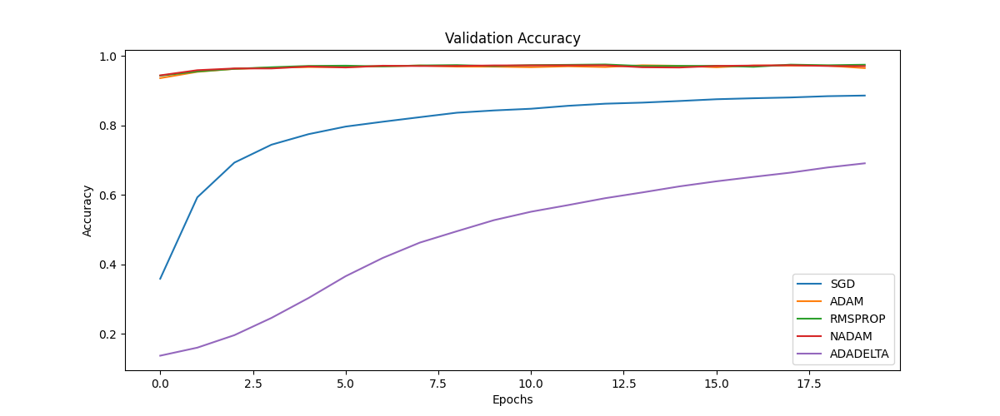
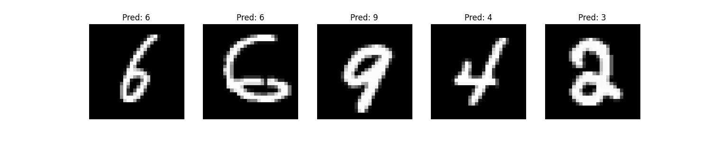

# Perceptrón Multicapa para MNIST

---

## Resumen
Este trabajo implementa una red neuronal **Perceptrón Multicapa (MLP)** para clasificar dígitos manuscritos usando el conjunto de datos MNIST. Se exploraron:

- **Optimizadores**: SGD, Adam, RMSprop, Nadam, Adadelta.
- **Arquitecturas**: Variaciones en capas ocultas (128-256 neuronas).
- **Hiperparámetros**: Tasa de aprendizaje (0.001-0.01), épocas (20).

Se utilizaron funciones de activación **ReLU** (capas ocultas) y **Softmax** (salida). La evaluación incluyó precisión, pérdida, F1-score y matriz de confusión.

---

## Enunciado del Problema
**Objetivo**: Clasificar dígitos del 0 al 9 con:

- Precisión >97% en validación.
- Comparación sistemática de optimizadores.
- Análisis del impacto de hiperparámetros.
- Visualización de predicciones en datos no vistos.

**Datos**:
- `train.csv`: 42,000 muestras (entrenamiento).
- `test.csv`: 28,000 muestras (prueba).

---

## Código Utilizado

### Estructura del Proyecto
```
mnist_mlp/
├── src/                # Código fuente
├── mnist/              # Datos MNIST
└── results/            # Resultados (gráficas y métricas)
```

### Fragmentos Clave
**Preprocesamiento** (`data_preprocessing.py`):
```python
def load_and_preprocess_data():
    train_data = pd.read_csv('../mnist/train.csv')
    X_train = train_data.drop('label', axis=1).values / 255.0
    y_train = to_categorical(train_data['label'].values)
    return X_train, y_train
```

**Arquitectura del modelo** (`model.py`):
```python
model = Sequential([
    Dense(128, activation='relu', input_shape=(784,)),
    Dense(64, activation='relu'),
    Dense(10, activation='softmax')
])
```


---

## Resultados

### 1. Comparación de Optimizadores

- **Precisión en validación**:

  


- **Pérdida en validación**:

  


### 2. Tabla de Hiperparámetros
| Optimizador | Learning Rate | Capas Ocultas | Epocas | Precisión |
|-------------|---------------|---------------|--------|-----------|
| SGD | 0.001 | [128, 64] | 20 | 88.70% |
| ADAM | 0.001 | [128, 64] | 20 | 97.13% |
| RMSPROP | 0.001 | [128, 64] | 20 | 97.19% |
| NADAM | 0.001 | [128, 64] | 20 | 96.76% |
| ADADELTA | 0.001 | [128, 64] | 20 | 70.11% |


### 3. Predicciones en Test




---

## Conclusiones
1. **Adam** fue el optimizador más efectivo (97.13% precisión).
2. Arquitecturas profundas mejoran la precisión pero requieren más recursos.
3. Learning rates altos (>0.01) causan inestabilidad en el entrenamiento.
4. La normalización de datos fue crítica para la convergencia.

---

## Referencias
1. TensorFlow Documentation. [Enlace](https://www.tensorflow.org/).
2. Chollet, F. (2021). *Deep Learning with Python*. Manning Publications.
3. Bishop, C.M. (2006). *Pattern Recognition and Machine Learning*. Springer.
